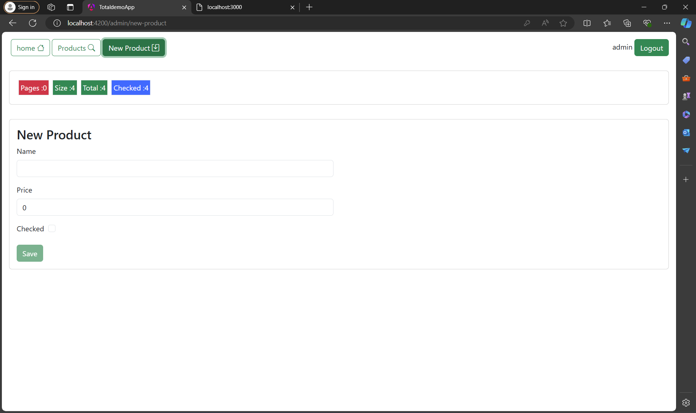
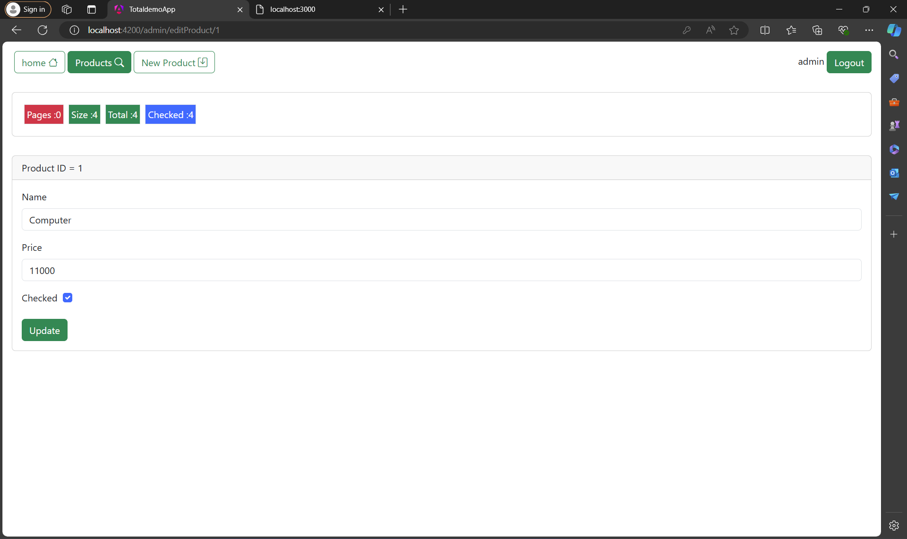
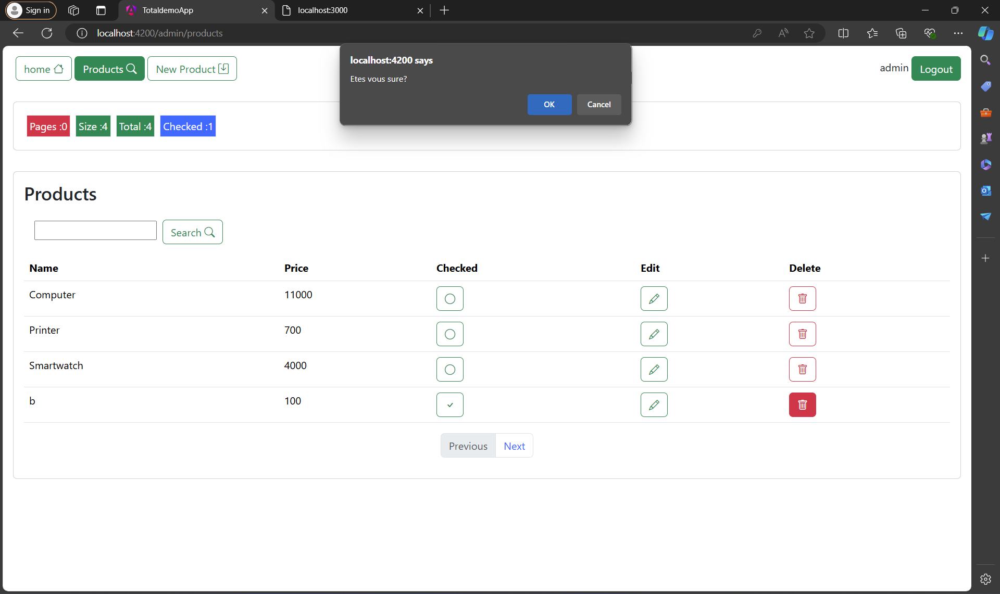
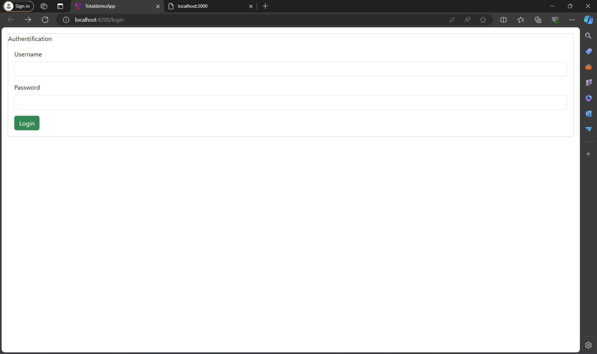

# Système de Gestion de Produits

## Objectif du Projet

Le projet vise à développer un système de gestion de produits en utilisant Angular pour le frontend et json-server pour le backend. Le système permet aux utilisateurs de gérer des produits en offrant des fonctionnalités pour ajouter, mettre à jour, supprimer et afficher des produits via une interface de tableau de bord administrateur.

## Description du Projet

### Backend

**json-server** : Un faux REST API complet utilisé pour fournir un backend simple et rapide pour le prototypage et les tests. Il gère les opérations CRUD pour les produits stockés dans un fichier `db.json`.

### Frontend

**Angular** : Une plateforme et un framework pour créer des applications client à page unique utilisant HTML, CSS et TypeScript.

### Fonctionnalités

#### Gestion des Produits

- **Ajouter un Produit** : Ajouter de nouveaux produits avec des détails tels que le nom, la description et le prix.

- **Mettre à Jour un Produit** : Modifier les détails des produits existants.

- **Supprimer un Produit** : Supprimer des produits de l'inventaire.

- **Afficher les Produits** : Lister tous les produits avec leurs détails.

#### Tableau de Bord Administrateur

- Une interface conviviale pour gérer les produits.

